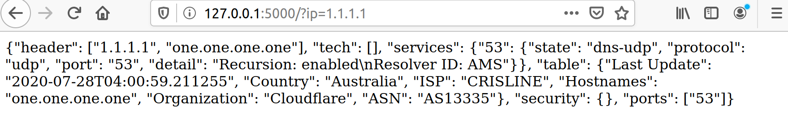

# shodan_parser

## Requiretmants

```
selenium
bs4
flask
```
## How to use

just run `python shodan_api.py`



## P.S.
If you use your own chrome, remember to change the **chrome** and **driver** version.
